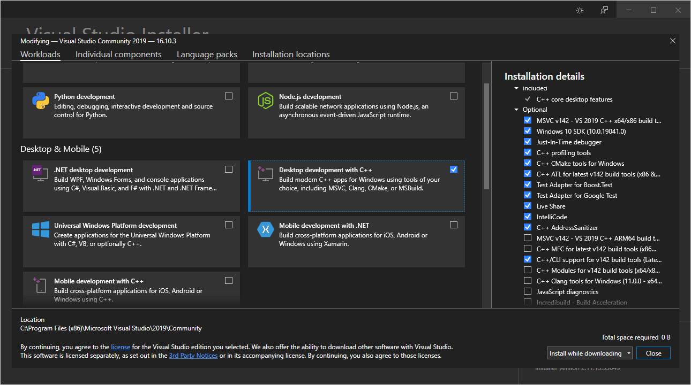
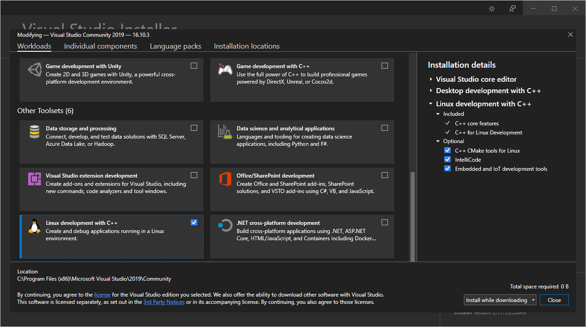
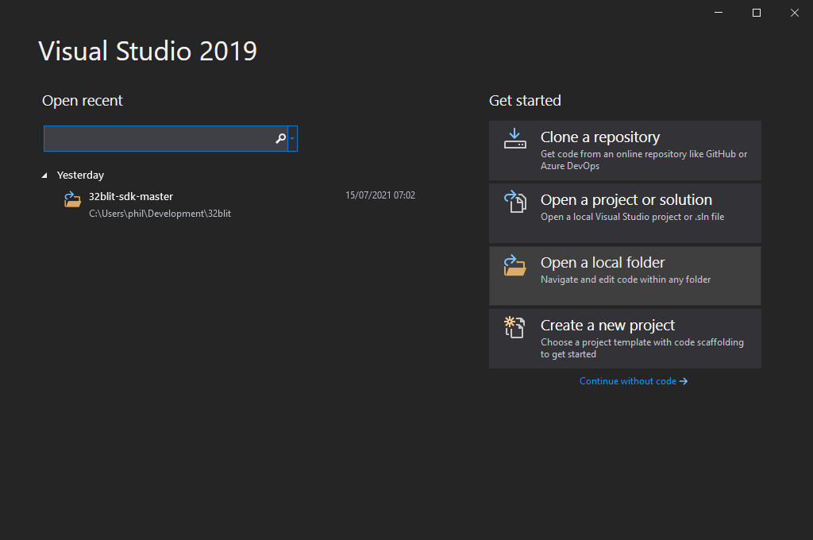
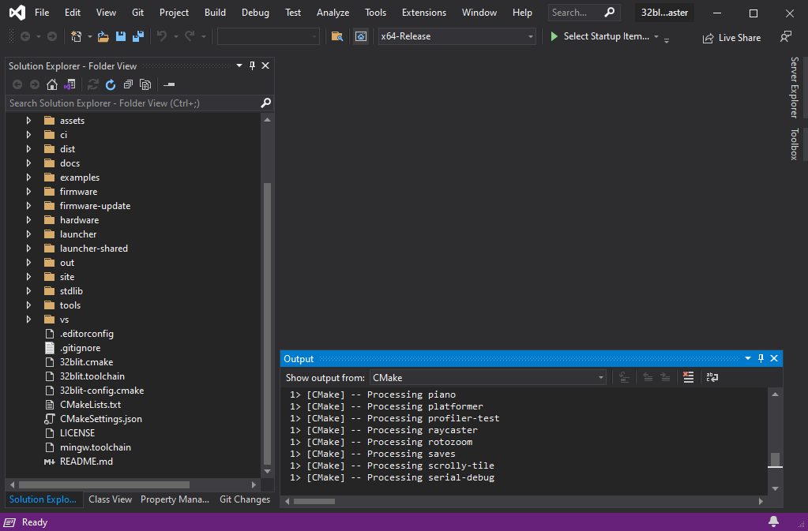
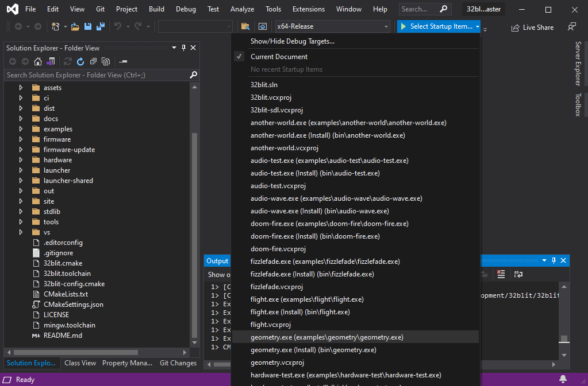
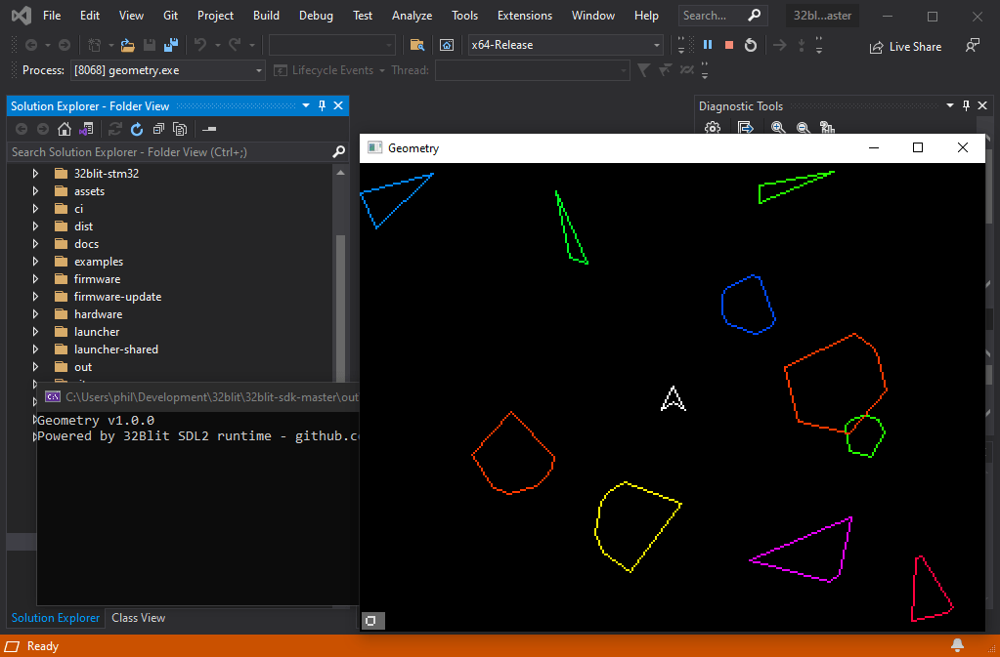

Title: C++ 0. Getting Started
Date: 2021-07-16 12:00
Modified: 2021-07-16 12:00
Category: C++
Tags: c++, tutorial
Slug: cplusplus-00-getting-started
Authors: Philip Howard
Summary: Getting started with C++ on the 32Blit

- [Introduction](#introduction)
- [Windows + Visual Studio](#windows--visual-studio)
  - [Installing Visual Studio & Requirements](#installing-visual-studio--requirements)
  - [Opening & Configuring Your Project](#opening--configuring-your-project)
  - [Configuring For 32Blit Builds](#configuring-for-32blit-builds)
- [Linux, macOS & Others](#linux-macos--others)

## Introduction

The 32blit SDK allows you to develop, debug and test your games on your computer. This tutorial will cover setting up Visual Studio on Windows.

## Windows + Visual Studio

To get started developing 32blit applications on Windows you'll need Visual Studio. Even if you plan to use VS Code eventually, you will need the Microsoft compilers included with Visual Studio to build & test on Windows itself.

We'll be relying on Visual Studio's ability to open, configure and build a CMake project.

This guide is modified from the Windows/Visual Studio documentation in the 32blit SDK - https://github.com/32blit/32blit-sdk/blob/master/docs/Windows-VisualStudio.md

### Installing Visual Studio & Requirements

You'll need:

* Visual Studio 2019 (preferably version 16.x) - [Visual Studio 2019 Community Edition](https://visualstudio.microsoft.com/thank-you-downloading-visual-studio/?sku=Community&rel=16)
* Python for Windows - [python-3.9.6-amd64.exe](https://www.python.org/ftp/python/3.9.6/python-3.9.6-amd64.exe)
* The latest 32blit SDK release - [Grab the Source code (zip)](https://github.com/32blit/32blit-sdk/releases/latest)

When installing Visual Studio, make sure you select:

* Desktop development with C++ - for Windows test builds

  

* Linux development with C++ - with "Embedded and IoT development tools" - for 32blit device builds

  

### Opening & Configuring Your Project

Use the "Open a local folder" and navigate to the 32blit SDK



Visual Studio should detect the CMake project and start configuring it immediately.



Once it's configured, select one of the non-install startup items from the list of debug targets.



And hit F5 to launch.



### Configuring For 32Blit Builds

If you'd like to use Visual Studio to create builds that run *on* your 32Blit there are a few extra configuration steps.

1. Open the CMake Settings by navigating to `Project` > `Cmake Settings`
2. Press "Add new configuration..." and select "IoT-Release".
3. Scroll down to "CMake toolchain file" and browse to `32blit.toolchain` in the root of the 32Blit SDK
4. (Optional) Change the configuration name to something like "32Blit-Release"
5. Save (Ctrl+S works in settings views)
6. Press "Edit JSON", scroll down to the new configuration and delete the contents of the `variables` array. The result should look like this:
```json
{
  "name": "32Blit-Release",
  "generator": "Ninja",
  "configurationType": "Release",
  "buildRoot": "${projectDir}\\out\\build\\${name}",
  "installRoot": "${projectDir}\\out\\install\\${name}",
  "cmakeCommandArgs": "",
  "buildCommandArgs": "",
  "ctestCommandArgs": "",
  "inheritEnvironments": [ "gcc-arm" ],
  "variables": [],
  "intelliSenseMode": "linux-gcc-arm",
  "cmakeToolchain": "[path...]/32blit-sdk/32blit.toolchain"
}
```
7. To work around a bug in Visual Studio you should also add a tweak to `"environments"`. This ensures that Visual Studio can find `cmd.exe` when building the project, and that it also prefers its own copies of the ARM GCC tools over those that might be elsewhere in your `PATH`:
```json
"environments": [ { "PATH": "${env.ProgramFiles(x86)}/Microsoft Visual Studio/2019/Community/Linux/gcc_arm/bin/;${env.PATH}" } ]
```

As before, select your preferred target from the drop-down list and build it. Note that the output will be a `.blit` file which you need to flash to your device using `32blit install game.blit`.


## Linux, macOS & Others

The community has kept an variety of platform documentation current for macoS, ChromeOS, Linux and Windows which you can find here: https://github.com/32blit/32blit-sdk/tree/master/docs