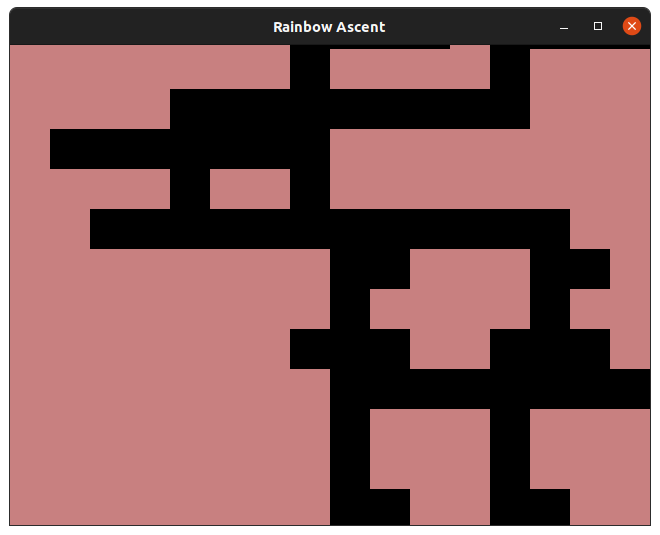
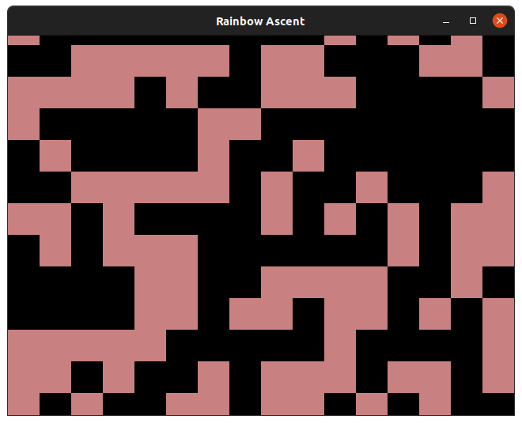
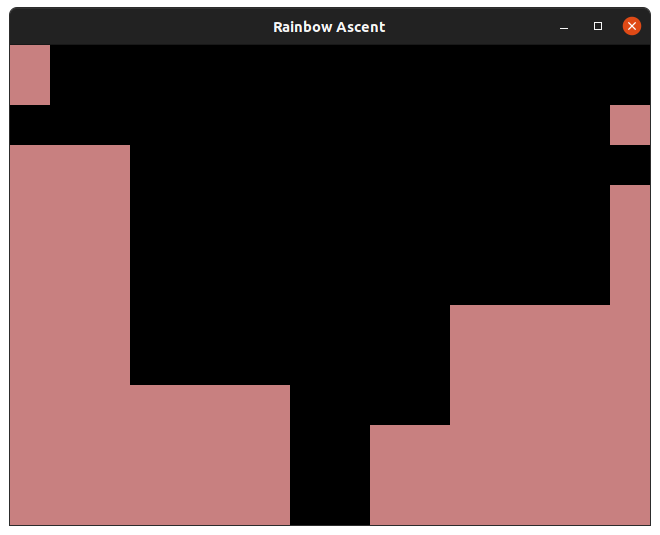
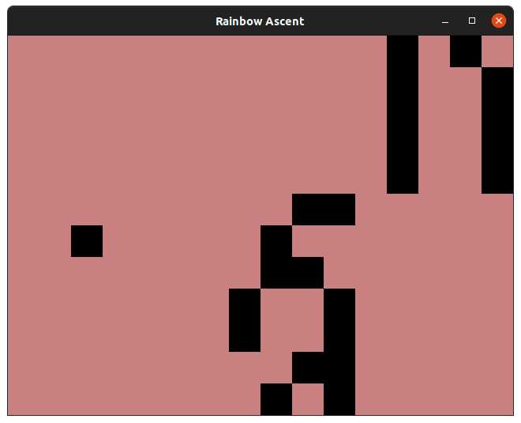
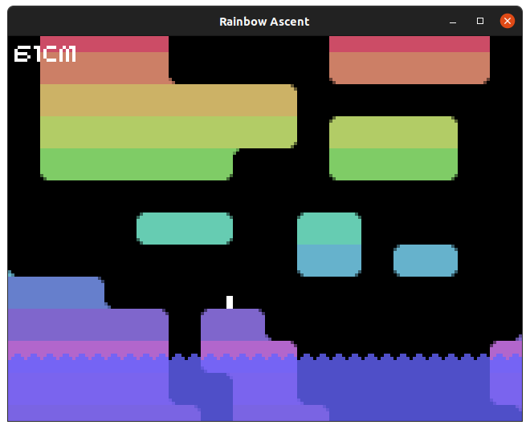
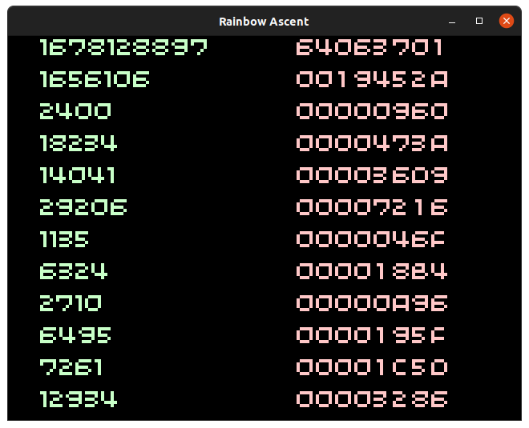

# Rainbow Ascent <!-- omit in toc -->

Rainbow Ascent was originally created over Christmas 2019 as a thought exercise: could I create an "algorithm" that continuously generated a vertical maze that a player could traverse from bottom to top without being trapped by dead ends.

The answer was yes, but the code wasn't particularly pretty and neither was the result. At the time I had no plans to turn the result into a playable game, so the tunnels were selected for their continuity and not playability.



This case study will touch upon the thought process behind Scrolly Tile - the crude level generation behind Rainbow Ascent - and how this simple mechanic, though layers of refinement, inspired a game with dynamic pacing.

1. How did I approach the problem
2. Why was this approach broken
3. How did I make it more "playable"
4. Turning the result into a game

- [The Initial Idea](#the-initial-idea)
  - [Deciding Upon 10x10 Tiles](#deciding-upon-10x10-tiles)
  - [Visual Presentation](#visual-presentation)
  - [The First Iteration](#the-first-iteration)
  - [Evaluating For Fitness](#evaluating-for-fitness)
    - [Fitness Isn't Enough](#fitness-isnt-enough)
- [The Second Iteration](#the-second-iteration)
  - [Passages](#passages)
    - [What Characterises A Passage](#what-characterises-a-passage)
    - [The Results](#the-results)
- [Fixing The Gameplay](#fixing-the-gameplay)
  - [Pseudo Random](#pseudo-random)

## The Initial Idea

In Rainbow Ascent's continuous, scrolling world the geometry has two states:

1. Navigable
2. Solid

Right at the very start I realised this meant that each tile of the level could be represented as a single "bit". This is great because it keeps the level data small, concise and easy to work with.

### Deciding Upon 10x10 Tiles

In low resolution 32blit's screen is 160x120 pixels which can contain 20x15 of 32blit's 8x8 tiles. At this point I could have stuck with this and picked a 32-bit integer as the storage for each "row" of the level, but the clean and tidy division of 16 tiles into a 16-bit integer was... alluring.

With 10x10 tiles I could display a 16-bit integer across the screen as level data - for example the first row of the level pictured above would be `0b0000000100001000` - and if I used bitwise operators to manipulate it I could expect predictable results.

### Visual Presentation

Because I was writing the code for the challenge of procedural generation - and had thrown away the concept of 8x8 tiles/sprites - I opted for very simple 10x10 pixel rectangles to represent the level. Rainbow Ascent went on to keep this style with some minor tweaks.

### The First Iteration

The basic concept was simple enough, with each row being represented by a 16-bit integer I could generate a row at a time using random numbers as a source of entropy.

At first my thought process was crude- "if a row is a number, then each row can just be a new random number."



```c++
uint16_t next_row() {
    return rand() & 0xffff;
}
```

Okay. Maybe not.

### Evaluating For Fitness

While purely random rows often resulted in passable levels purely by chance, the sheer amount of visual chaos, the dead-ends and the sudden stopping of passages resulted in an unholy mess that no player could traverse.

In order for the level on the whole to be "navigable" - ie: the player can move from bottom to top in a continuous passage - I had to evaluate each new row for fitness. This involved comparing the new row to the previous row and ensuring they shared at least some open passageways.

I ended up with some code that checked the new row against the previous row and ensured the two shared at least one "set" bit, indicating a passageway.

This wasn't meaningfully better than pure random, however, since one passageway could end as another began and - even though they weren't linked - this could pass the test.

#### Fitness Isn't Enough

The trouble with a naive approach that evaluates for fitness and rejects any rows which aren't suffuciently *continuous* from the previous level row, is that it doesn't feed back.

If the "algorithm" doesn't learn from its mistakes, or at least make a minimal effort to produce passages that satisfy our requirements then we'll find ourselves throwing away row after row after row of data that's been rejected.

I realised that what I really wanted was a passageway that would cut continuously through the level and wind back-and-forth under some given constraints.

Since I knew the passageway would continually wind *up*, what remained was winding it left/right. In my 2019 attempt at solving this problem I had yet to arrive at the conclusion that I should track passageways as separate, tangible things and "cut" them throught the level. My approach to winding a passageway was crude and involved "smearing" the previous row of level data left/right by 0-7 steps:

```c++
uint16_t next_row(uint16_t current_row) {
    uint8_t turning_size = std::rand() % 8;
    uint16_t next_row = current_row;

    switch(std::rand() % 3){
        case 0:
            while(turning_size--){
                next_row &= (next_row >> 1);
                next_row |= 0b1000000000000000;
                next_row &= 0xffff;
            }
            break;
        case 1:
            while(turning_size--){
                next_row &= (next_row << 1);
                next_row |= 0b0000000000000001;
                next_row &= 0xffff;
            }
            break;
    }
    return next_row;
}
```

This code would generate a random number with the possible values: `0, 1, 2`.

A switch statement would then determine if that number meant "smear left", "smear right" or "do nothing."

Smearing would shift the level left/right and `and` it with itself causing any unset bits (which represent passageways) to spread to adjacent bits.

This approach, however, was destructive:



With no new source of level data, eventually a single starting seed would be smeared across the level and the only remaining set bits would be at the extreme edges.

I'll just fill the gaps...

```c++
    while(count_set_bits(new_row_mask) < 14){
        uint8_t set_bit = std::rand() % 16;
        new_row_mask |= (1 << set_bit);
    }
```

Uh, whoops!



## The Second Iteration

Sometimes it's important to recognise the passage you're navigating might not be the right one. In this case I had painted myself into a corner by trying to smude and smear rows of level data around in order to produce a working, continuous passage. The level generation function was spending more time patching over its flaws than anything else.

### Passages

Since what I wanted to achieve was a maze of passages, it made more sense to introduce the concept of a passage into the code. Keeping track of individual passages meant that I could wind them back and forth independent of each other and, when it came to making each new level row, ensure they were continuous, consistent and traversable.

#### What Characterises A Passage

A passage could be expressed almost like a player, needing only information like its position, direction and width in order to render it into the world.

When each new level row is generated, the particulars of each passage are taken into account and they are carved into the world.

Since the Y position (vertical) is constantly incrementing as the level generates I only needed to take into account the X position (horizontal). By using `random` indirectly to determine when a passage should change directon, I managed to preserve the random-driven procedural generation without breaking the rules that should constrain a passage. On each row the previous and next position of the passage is taken into account and it's drawn accordingly, linking these two points.

In order to give the game dynamic pacing, the "width" of passages is increased/decreased in lockstep as the level progresses. Easy, simple, single passages open up into complicated, expansive caves with much more margin for error and fewer footholds. In Rainbow Ascent "width" corresponded to how many passages were enabled at once, rather than how wide any given passage should be.

As a consequence of turning passages off, I needed some edge-case code to link passages back to the main passage when they were disabled.

#### The Results

These changes are somewhat caught admidst a sea of changes I made in January 2020 which included a striking rainbow graphics overhaul and the mechanics to carve a somewhat playable game out of this mess.



But most striking of all is the passages. This change in perspective resulted in levels that looked more intentional, more traversible and less punishing than those generated before.

The beaty of snaking passages was in their instructibility. As they narrowed and widened and crossed and weaved it was often impossible to see them as individual passages. The boring concept of a winding passageway became, instead, dynamic tunnels criss-crossing, exploding out into caves with plaforms and making a whole greater than the sum of its parts.

But something was missing. It was too random, and difficult for any two players to meaningfully compare progress.

## Fixing The Gameplay

Early Rainbow Ascent offered an individual player a challenge to overcome the mechanics and level quirks and get the highest climbing score possible. But it offered no repeatability. Levels weren't just random, they were cryptographically secure random so not only could a player *not* try the same level over and over again and master its passageways... but that player would never see the level they just failed ever again.

### Pseudo Random

I needed psuedo random numbers to create predictable, but random-looking levels that everyone could see and replay. To do this I needed to brush up on LFSRs or Linear Feedback Shift Registers.

LFSRs are extremely simple, iterative functions that mutate a sequence of bits in an expected, but seemingly random pattern. It starts with a "seed", a number chosen either by the programmer or the user, and then produces a sequence of numbers based upon it:

```c++
uint32_t prng_lfsr = 0x64063701;
const uint16_t prng_tap = 0x74b8;

uint32_t prng_next() {
    uint8_t lsb = prng_lfsr & 1;
    prng_lfsr >>= 1;

    if (lsb) {
        prng_lfsr ^= prng_tap;
    }
    return prng_lfsr;
}
```

While the numbers produced *feel* random, the actual output when setting `prng_lfsr` with a given seed value and calling `prng_next()` is entirely predictable. This is excellent for producing levels which don't look repetative, don't require any hand-crafting, but can be reproduced across multiple devices with the same logic.

Below is a table showing every 10th output from the LFSR starting with our seed:



Looks random enough! But, given the above seed, our `prng_next()` function will *always* return this same sequence of numbers.