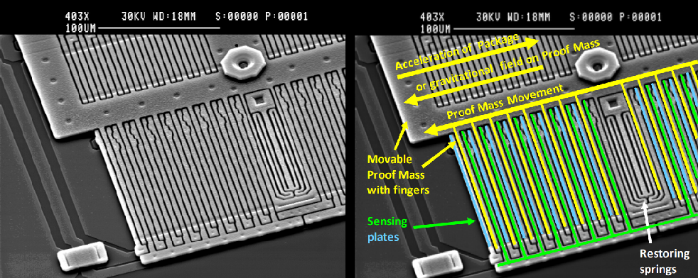

Title: Choose your own sprite-venture!
Date: 2021-07-16 12:00
Modified: 2021-07-16 12:00
Category: Introduction
Tags: tutorial
Slug: intro-7-choose-your-own-sprite-venture
Authors: Jon Williamson
Summary: Check out the results of our stretch-goal sprites vote and get a sneak preview of the other spritesheets

- [Introduction](#introduction)
- [Stretch goal sprites](#stretch-goal-sprites)
    - [#1. Sci-Fi Top-Down Shooter](#1--sci-fi-top-down-shooter)
    - [#2. Sprite smorgasbord](#2--sprite-smorgasbord)
- [Platformer](#platformer)
- [Shmup](#shmup)
- [RPG](#rpg)
- [License](#license)

---
layout: post
title:  "Tilt!"
date:   2019-05-29 05:00:00 +0100
categories: introduction
summary: "We show you how to add some rock and roll to your games with a motion sensor."
tracker: "ax6hso"
list_image: "banner.png"
published: true
---
One of the most exciting advancements in electronics since the heyday of 8- and 16-bit consoles is the invention of [MEMS](https://en.wikipedia.org/wiki/Microelectromechanical_systems) (Microelectromechanical systems) devices.

These amazing little mechanical contraptions are used to measure movement, power the printing head in your inkjet, the pressure sensors in your car tyres, and the tiny little microphones in mobile phones.

It wouldn't have been possible back in the early 90s but we thought it would be a fun addition that opens up a lot of interesting gameplay options for your **32blit**.

## How do they work?

MEMS are tiny little machines with actual moving parts that are manufactured on a micro-metre scale. The features of these devices are so small that they can only be imaged with a [scanning electron microscope](https://en.wikipedia.org/wiki/Scanning_electron_microscope).


*SEM Image of MEMS Accelerometer (© Freescale Semiconductor)*

> The patterns are etched out of silicon which is the same material used to make computer chips, that's handy!

The fins and springs in the photo above respond to and dampen movement. The force of these movements is measured electronically, intepreted by an integrated processor, and then can be read from the accelerometer chip via standard protocols. They really are amazing little devices!

Though they may look delicate, in reality they are incredibly robust. The scale is so tiny and the movements are so miniscule that they can take a lot of abuse - they have no problem being thrown, dropped, or shaken.

The accelerometer in **32blit** detects acceleration (the clue is kinda in the name...) which means it can detect the force of gravity. This allows us to use it to determine how the device is tilted at any time.

## Let's try it out
Working with the tilt sensor in **32blit** is very straightforward -- we provide you with a 3-axis vector that always contains the current X-, Y-, and Z-axis values from the accelerometer.

> The virtual horizon (or attitude indicator) in a plane tells the pilot what angle the plane is relative to the ground.

As an example we'll build a little virtual horizon like the ones used in a plane's cockpit.

If you're using our provided game loop then you need to provide implementations for two methods; `update()` and `render()` which will be called automatically based on the target frame rate and update rate.

In `update()` we do anything that's needed to update the game state. This might include moving entities around, performing collision detection, or processing input. In `render()` we draw the current frame reflecting that game state. We'll have a more in-depth look at the gameloop in a later blog post.

> **vec2** is a type in our code library that provides a load of common 2D vector operations.

For our horizon we need to know what angle the **32blit** is currently being held. We calculate this in our `update()` function and then store it in a global variable so that it can be used later when drawing the horizon.

Let's take a look at how that might work...

```c++
// this is where we'll always store the current angle (in radians)
float angle = 0.0f;

void update(uint32_t time_ms) {
    // create a normalised vector representing the "down" direction
    vec2 down(0, 1);

    // extract our tilt vector (we are ignoring the z-axis for this demo)
    vec2 tilt(input::tilt.x, input::tilt.y);

    // calculate the signed angle between our down vector and the current tilt
    angle = down.angle(tilt);
}
```

> **radians** are the standard unit used for measuring angles in mathematics. It's easy to convert between degrees and radians if you need to!

...that was easy enough! We now have the angle (in radians) stored in a global variable. It'll be recalculated every time `update()` is called for us by the game loop.

Now we need to draw our horizon. This is a quick demo so we'll just fill the whole screen with sky colour, then draw a brown rectangle to represent the ground which tilts depending on the angle we've calculated...

```c++
// a reference to our drawing surface which is provided to us by
// the 32blit libraries automatically
surface &fb;

void render(uint32_t time_ms) {
    // it's a sunny day with blue skies here in 32blitsville
    rgba sky = rgba(0, 142, 239);
    fb.pen(sky);
    fb.clear();

    // this is a list of points that represent a rectangle, we can
    // pass it directly to the `polygon` function on our framebuffer
    // to draw it
    std::vector<point> ground = { point(-200, 0), point(200, 0), point(200, 200), point(-200, 200) };

    // we need to rotate our points to the angle of tilt, we do
    // this by creating a transformation matrix and multiplying that
    // by each of our points
    mat3 transform = mat3::identity();
    transform *= mat3::translation(vec2(160, 120));    // offset to screen centre
    transform *= mat3::rotation(-angle);               // rotate to angle

    // rotate and transform the points
    for (auto &p : ground) {
        p *= transform;
    }

    // and draw the ground in a fetching brown
    fb.pen(rgba(108, 87, 53));
    fb.polygon(ground);
}
```

...and here's the result...

<video width="640" loop autoplay muted playsinline>
    <source src="virtual-horizon-demo.mp4" type="video/mp4">
    Sorry, your browser doesn't support embedded videos.
</video>*I feel the need -- the need for speed!*

...it's like we've got our flying goggles on and are sat behind the yoke ready for take-off. Chocks away!

> Don't worry if the matrix and vector maths feels daunting -- it's actually really easy to get your head
> around and we'll cover that subject in more detail soon!

I added a few extra details to make it a bit more interesting but the process for drawing those is largely the same.

We're currently working on adding support to 32blit to allow all drawing operations on a surface to automatically apply a transform -- making the code above even simpler. It's good that you get to see what goes on under the hood though.

## What else could we do with it?
The tilt sensor is an extra set of analog inputs that you can use to make your games more interesting.

> Tilt control could be offered as an alternative to the analog stick for some types of game.

It could be the primary input, like in a marble maze game, or just add a bit of interest, perhaps by changing the forces that apply to your [particle effects](/posts/2019/05/25/particle-effects).

Some ideas to try out:

- **Rotation** -- change gameplay depending on whether you're holding it horizontally or vertically.
- **Turning** -- give the player more direct control over their steering inputs.
- **Parallax** -- enhace parallax effects by adding a touch of extra offset based on tilt.
- **Gravity** -- have your game physics take into account the current "down" direction.

No doubt you'll come up with some great ideas too -- make sure you share them with us!

## Pushing our luck
One of our **32blit** sample projects is a virtual sandbox which uses the tilt sensor to determine the direction the sand flows. Here we're processing 5,000 separate "sand particles" in realtime which interact with each other and respond to the tilt of the device.

Here's a video of the example running on my prototype **32blit**:

<video width="640" loop autoplay muted playsinline>
    <source src="sandbox-demo.mp4" type="video/mp4">
    Sorry, your browser doesn't support embedded videos.
</video>*Save hours by not having to drive to the beach!*

It's a lot of fun to play with and all of the source code will be in the main **32blit** code repository so that you can pull it apart, modify it, and learn from it.