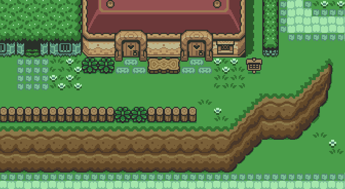
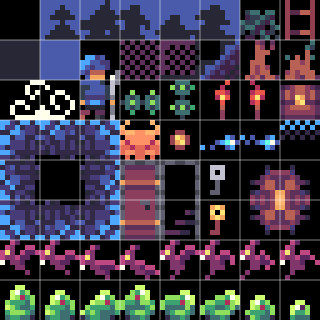
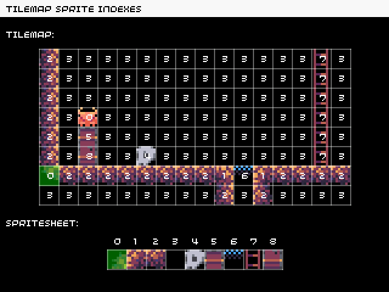

You've played The Legend of Zelda, Super Mario Bros, or Sonic the Hedgehog, right? The worlds in all of those classic games, and many others, were built from tilemaps.

Let's take a look at how they work, and how easy they'll be to build and handle with the tools (like our tilemap editor) in 32blit, as well as taking a little peek at our first set of 32blit game assets!

## What is a tilemap?

The world that you explore in any game, be it a platformer, an RPG (role-playing game), or flight simulator, sets the mood and journey that the player experiences.

The sprites and objects in these games sit on top of the tilemap that makes up the background of the world in which they live, with grass, rocks, trees, houses, paths, and so on, as in Kakariko Village from [The Legend of Zelda](https://en.wikipedia.org/wiki/The_Legend_of_Zelda), show below.


*Kakariko Village from The Legend of Zelda - A Link To The Past (© Nintendo)*

Each part of the tilemap is split into separate tiles, for example you might have four different tiles that represent different types of tree, and these tiles are a set size, usually 8x8 or 16x16 pixels. The whole collection of these tiles is called a spritesheet, and the spritesheet will be a set size like 64x64 pixels (and therefore contain 64 tiles).


*Part of our 8x8 fantasy/dungeon crawler spritesheet. Oh no, bats!*

Building a game's world, or tilemap, from a tile spritesheet has a few advantages:

- it saves space in memory
- it simplifies game design, by fitting everything to a grid
- you can create variety by rotating or mirroring the same tile
- you can flag tiles to say e.g. "this rock tile should be solid"

## How did classic consoles handle tilemaps?

The consoles of the late 80s and early 90s, like the NES or Mega Drive, often had dedicated hardware that specifically handled transforming and copying ([blitting](https://en.wikipedia.org/wiki/Bit_blit)) pixel data. The CPUs of the time simply weren't powerful enough to do this in software.

With 32blit, we want to let you recreate the style of the classic games that you loved but fortunately for you, and for us, we've got much more powerful hardware to work with than the classic 8- and 16-bit consoles.

Nowadays, the ubiquity of mobile phones has driven the development of small, powerful, energy-efficient CPUs like the ARM-based chip in 32blit (the STM32H750), and we can easily blit all of the pixel data, and a whole lot more besides, directly with the CPU.

## A toy example of a 32blit tilemap

If a whole game is a plate of meatballs and spaghetti, and the tilemap is the spaghetti, then the game's code is the delicious sauce -- wait, I have no idea where I'm going with this, let's start again...

The tilemap defines the overall structure of your game. It tells the game code where parts of the environment are, what's solid and what's traversible, optionally it may add other information like event triggers, spawn points, lighting information, and so on.

> This tile set was created for us by the very talented pixel artist [@s4m_ur4i](https://dribbble.com/s4m_ur4i)!

As well as being a tool to build your game worlds, our **32blit** tilemap editor exports all of the map data -- the position and rotation of tiles, flags on tiles, etc -- into a single file that can be used and referenced in your game code.

Let's take a look at a toy example of a tilemap for a platformer with our first set of dungeon-crawler assets:


*See how the tilemap indexes map into the spritesheet*

>The animation above, and other animations in our future blog posts and tutorials were created entirely on **32blit**!

The tilemap is 16 tiles wide by 8 tiles tall (128 tiles total), but uses just nine unique sprites.

Each tile in the tilemap is represented by two numbers: the index of the sprite in the spritesheet and some extra metadata (such as whether the sprite is mirrored or rotated). Storing just these numbers rather than the full sprite image data reduces the amount of memory needed by a whopping 97%!

Our tilemap editor will let you build maps like this quickly and easily, by loading in a spritesheet, dragging, dropping, rotating, and mirroring the tiles, setting flags, and then exporting the tilemap into a format you can load directly on **32blit**.

Loading and drawing this tilemap in your game code is really straightforward too. Here's an example of how to do this in C++ (We'll delve into the Lua alternative in another post):

```c++
const uint8_t sprite_data[] = { ... };     // exported from the sprite editor
const uint8_t world_data[] = { ... };    // exported from the tilemap editor

// create our spritesheet and tilemap
spritesheet sprites(sprite_data, 8, 8);
tilemap world(world_data, size(16, 8), &sprites);

void init() {
    // go into hires mode (320x200)
    set_screen_mode(screen_mode::hires);
}

void render(uint32_t time_ms) {   
    // draw our tilemap with translation, 32blit handles the details!
    mat3 world_transform = mat3::translation(vec2(32, 32));    
    world.draw(framebuffer, framebuffer.bounds, world_transform);
}
```

So, we can build worlds for retro-style games in a way that feels faithful and familiar to those games, but use tools and code that feel friendly and frictionless.

We'll take a look at more complex tilemap concepts like transformations and effects that really add to the visual style of your games in future articles.