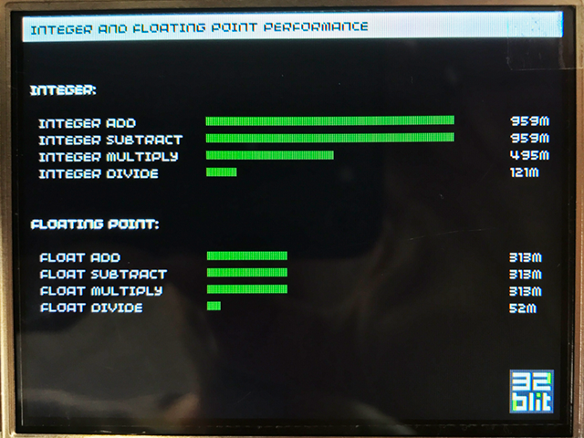

*Note: This article is relatively technical and contains some jargon. It's not critical that you understand it all to use **32blit** but it's a potentially interesting look at one aspect of the hardware!*

Traditional advice for older hardware and micro-controllers would be to avoid floating point operations at all costs. They had to be emulated in software requiring many processor cycles, sometimes hundreds per operation, to complete.

This meant that often using integer math was orders of magnitude faster however it is not as convenient for many tasks.

## Integer? Floating? What?!
Numbers are core to every computation your laptop or phone does. Whether it's working out where to draw something on screen, how to process an incoming network packet, or determining how far the mouse has moved since it was last checked.

> It boils down to a performance/capability trade-off and it's worth understanding some of the reasons why.

When programming we need to select the correct type of number for the job. Because we don't have infinite storage space or computing power it's necessary that numbers are limited either by scale or accuracy and it's important to understand the tradeoffs.

Most simply the choice is down to whether we only need whole numbers (e.g. 1, 42, 1337), which are called [integers](https://en.wikipedia.org/wiki/Integer), or decimal numbers (e.g. 0.3, 1.5, 3.14159), often referred to as [floating point](https://en.wikipedia.org/wiki/Floating-point_arithmetic), for our calculations.

**Integers**

- Can only represent a whole number (signed or unsigned)
- Have a minimum and maximum value (depending on their size)
- Tend to be the fastest for calculations (though not always!)
- Allows some interesting operations (bit shifts, XORs, masking)

**Floating point**

- Can represent decimal numbers (signed or unsigned)
- For very large and small numbers they are an approximation
- Can represent a huge range of numbers
- Require a hardware floating point unit ([FPU](https://en.wikipedia.org/wiki/Floating-point_unit)) for good performance

> Fixed point is a clever method to get decimal-like numbers while only using fast integer instructions.

It's worth mentioning that there is another type of number representation that was often used called [fixed point](https://en.wikipedia.org/wiki/Fixed-point_arithmetic) -- it takes some of the benefits (and some of the downsides) from integer and floating point numbers but most importantly it's fast enough for hardware that didn't have an FPU to use.

The STM32H750 processor in **32blit** includes a hardware floating point unit meaning we don't have to compromise for performance, we can select the best type of number to get the job done -- hurrah!

## Absolute unit

To test the performance of the floating point unit on **32blit** We created benchmarks for common mathematical operations using both integer and floating point instructions.

> When benchmarking performance it's important to understand what optimisation tricks the compiler might use.

The processor in **32blit** runs at 480MHz and is "dual issue" meaning that, under the right circumstances, it can execute two instructions at the same time.

This sets our theoretical maximum number of instructions per second at 960 million -- wow, almost a billion per second!

What did we find?

*Photo of benchmarks running on my prototype **32blit**.*

> For the benchmarks we are comparing 32-bit integer operations with 32-bit floating point operations.

Whaddya know? 959 million instructions per second, looks like our benchmarking is right on the money and fully saturating the processor.

Different types of instructions take a different number of processor cycles to complete. As we can see from the benchmark results integer addition and subtraction complete in a single cycle and so hit the theoretical maximum for the chip.

Other instructions take a different number of cycles to complete:

|Type|Instruction||Per second|Cycles|
|--|--|:--:|--:|--:|
|Integer|Addition|+|959m|1|
|Integer|Subtraction|-|959m|1|
|Integer|Multiplication|*|495m|2|
|Integer|Division|/|121m|8|
|Float|Addition|+|313m|3|
|Float|Subtraction|-|313m|3|
|Float|Multiplication|*|313m|3|
|Float|Division|/|52m|18|

> Divide operations are always a lot slower, generally taking around 10-20 times longer than other basic maths functions.

The most interesting result here is that the floating point calculations run at about one-third to one-half of the speed of integer calculations -- that's really neat! It's fast enough to do millions of calculation per frame and still get great performance in our games.

It's all thanks to the hardware floating point unit on the **STM32H750** processor we're using. Without it the floating point calculations would be more than ten times slower!

## Summing up

It's clear that the floating point unit in **32blit** makes using floating point numbers a viable option in our games -- and that's a very good thing!

A game's code is constantly churning through millions of mathematical operations every second to update the position of enemies, calculate collisions, fire projectiles, and draw things on screen. The fact that our numeric toolbox isn't limited to integers only makes many of these tasks a lot easier to deal with.