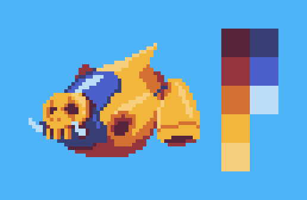
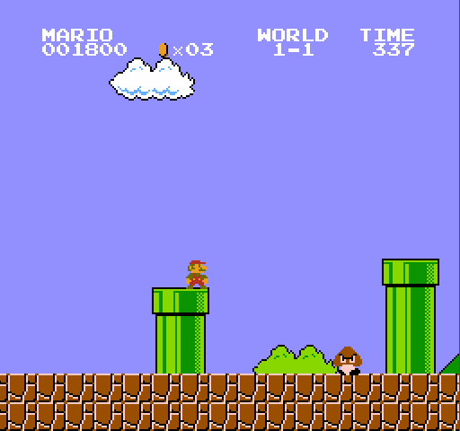

Designing your assets from a limited palette of colours might sound like a drag, but it can open up some interesting techniques for saving sprite space and boosting the visual variety of your game.

## What is a palette?

A palette, much like a painters palette, is the collection of colours that comprise your artwork.

When we talk about palette-based images we're saying that every single pixel - instead of storing an amount of red, green and blue - stores an index into a palette that determines what colour it will be.

Here's a ship sprite and its 8-colour palette:

*Sprites tend to have limited colour palettes, this one uses just 8!*

## What do we mean by swapping colours?

Because every pixel in palette-based artwork relies on the palette to tell it what colour it should be, we can play some neat tricks with our artwork.

Just by changing the colour values in the palette we can re-colour all of the pixels that reference that value. If those pixels happen to be the hair of a character sprite then suddenly we can change our character's hair colour. It's much more efficient to do this with one or two palette swaps than to have entirely separate artwork.

But it doesn't end there. Swapping colours is fast and cheap compared to drawing pixels to screen. It's not uncommon to do it between horizontal scanlines on classic hardware, or before each sprite is drawn. This let early game designers vary the colour of their sprites in a frame, turning a single sprite into an array of differently-coloured enemies that could all be present in the same scene.

Mario Bros used this trick to change clouds into bushes, saving valuable space that they used for detailed character and enemy animation:

*That bush looks... familiar*

**32blit** lets you swap your sprite's palette at any time for any colours of your choosing.

Here we're swapping 5 of the 8 colours that make up our artwork, but the data that describes where our pixels are and what colour they should be hasn't changed:

<video width="640" loop autoplay muted playsinline>
    <source src="palette-swap.mp4" type="video/mp4">
    Sorry, your browser doesn't support embedded videos.
</video>*Just a simple 5-colour swap and we've got a new ship*

For each colour ship we'd just store the 5 RGB colours that differ:

```
rgba alternate_palettes[NUM_PALETTES][5] = {
    {
        rgba(87, 37, 59),
        rgba(148, 54, 61),
        rgba(213, 112, 51),
        rgba(242, 182, 61),
        rgba(247, 206, 123)
    },
    {
        rgba(37, 38, 87),
        rgba(85, 53, 148),
        rgba(179, 51, 213),
        rgba(242, 61, 226),
        rgba(247, 123, 236)
    },
    {
        rgba(87, 87, 87),
        rgba(148, 148, 148),
        rgba(195, 198, 212),
        rgba(225, 223, 240),
        rgba(245, 245, 245)
    },
    {
        rgba(91, 21, 21),
        rgba(134, 31, 31),
        rgba(181, 21, 21),
        rgba(233, 39, 39),
        rgba(253, 76, 76)
    }
};
```

And then we can replace our artwork's palette on a whim. In this case we're doing it once a second for the above demo:

```
void render(uint32_t time) {
  int palette_index = int(time / 1000.0) % NUM_PALETTES;

  for (int x = 0; x < 5; x++){
    ss_boar_ship.s.palette[4 + x] = alternate_palettes[palette_index][x];
  }
);
```

Now that we've got swapping colours nailed, we can use the same technique to swap our palette before every sprite we draw. Let's have one ship in each colour:

<video width="640" loop autoplay muted playsinline>
    <source src="palette-swap-multiple.mp4" type="video/mp4">
    Sorry, your browser doesn't support embedded videos.
</video>*One ship in each colour with just one 840 byte packed asset*
