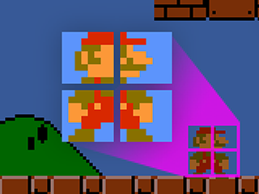
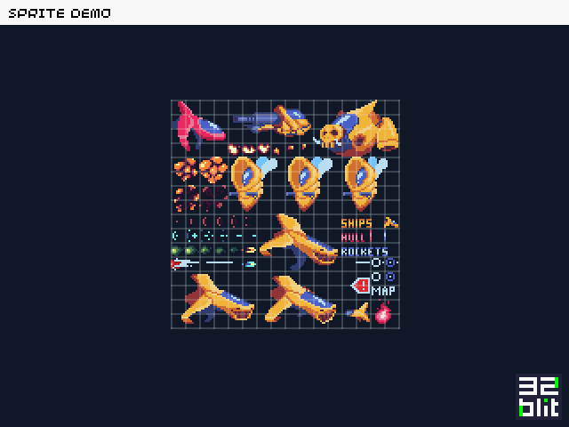
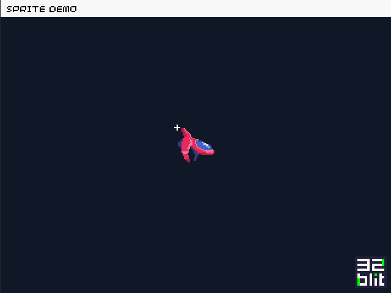
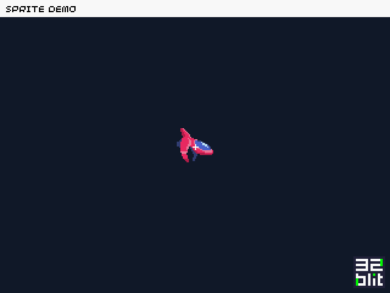
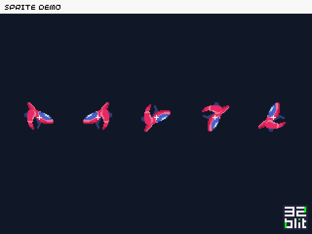
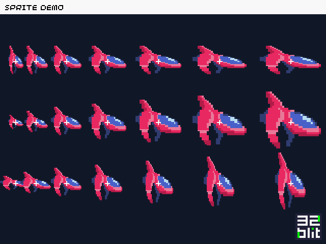

Sprites are the bread and butter of classic gaming. Most 8- and 16-bit consoles had dedicated hardware and memory for storing and drawing sprites to screen so that the action wouldn't be limited by their underpowered CPUs.

Often this special hardware had interesting limitations such as the number of colours you could use per sprite or the number of sprites that could be visible on a specific scanline of the display -- the game programmers of the time had to work hard to overcome these restrictions and still make compelling, action packed, games.

## What is a sprite?
Historically a sprite refers to a small image which can be placed at any location on the screen. These “hardware sprites” were a feature of the console's hardware and were critical in games where characters, enemies, and projectiles need to move fluidly around the screen.

These days "sprite" more commonly refers to any small image used in a game such as the player's character, collectable objects, or parts of the scenery. The sprite images are often stored in a "spritesheet", a larger image, which contains many sprites laid out in a grid and share the same colour palette.


*Super Mario Bros. (© Nintendo)*

Just because our sprites are 8 by 8 pixels it doesn't mean our graphics are limited to that size -- in the screenshot above the Mario character is composed of four separate sprites which are drawn next to each to give the illusion of a single, larger, sprite.

## Sprites in 32blit

The **32blit** API has a number of features for handling sprites including loading, positioning, scaling, rotating, and alpha blending.

First of all we need to load a spritesheet, an image that contains all of the different sprites we're using. The spritesheet we're using here is 128 by 128 pixels and looks like this:


*Preview of part of the space "shmup" spritesheet*

I've overlaid a grid to make it clear where the sprite boundaries are - you can see how characters and objects of different sizes all occupy the spritesheet. When we draw a sprite to the screen we can specifiy how many "cells" in the spritesheet it occupies.

Let's load it into our project...

```c++
// 'space_sprites' is the packed data stored in flash
const uint8_t space_sprites[] = { ... };

// load and set as the current spritesheet on our framebuffer
fb.sprites = spritesheet::load(space_sprites);
```

> We store our spritesheet as a paletted image instead of true colour. This saves space in memory!

The packed spritesheet data includes all of the information about how big the spritesheet is, how large individual sprites are, the colour palette, as well as the image data itself.

Now that it's loaded we can easily draw sprites to the framebuffer. We just need to tell the sprite drawing function a few details:

- **sprite**: which sprite we want to draw (either an index, a point, or a rectangle)
- **position**: point on screen where we want to draw the sprite

```c++
void render(uint32_t time_ms) {
    // define position
    point position(144, 104);

    // draw the sprite
    fb.sprite(
        rect(0, 0, 4, 4), // draw a 4x4 grid of sprites starting at cell 0, 0
        position);
}
```


*Lonely ship in the infinite void of space*

The **32blit** libraries have taken care of stitching together the different sprites to draw the image.

## Origins

In our previous example, we had to offset our drawing position to `144, 104` instead of the centre of the screen which would be `160, 120`. This is because the default origin (start point) of the sprite is the top-left pixel -- i've added a crosshair showing the origin position.

> Don't worry if the code examples seem confusing -- we'll spend a lot more time explaining it in the tutorials.

When we're dealing with sprites in our games we usually want to use a more natural origin such as the centre of the image as it makes calculating positions and collisions simpler.

Our spaceship is 32 by 32 pixels in size, so the centre is at `16, 16`. We can pass this as another parameter to the `sprite` function.


```c++
void render(uint32_t time_ms) {    
    // define position and origin
    point position(160, 120);
    point origin(16, 16);

    // draw the sprite
    fb.sprite(
        rect(0, 0, 4, 4),
        position,
        origin);    // we've added our origin!
}
```


*Lonely ship in the infinite void of space -- "Centred Edition"*

And now our ship is perfectly in the middle of the screen with the origin placed at its centre.

## Transforms

Another useful feature is to be able to mirror and rotate our sprites. This allows us to re-use sprites, saving space in our spritesheet. For example we don't need to have sprites of our player looking both left and right if we can just flip the image in our code.

Transforms are passed through as another parameter to the `sprite` function.

```c++
void render(uint32_t time_ms) {
    // define position and origin
    point position(160, 120);
    point origin(16, 16);

    // draw the sprite with no transform
    fb.sprite(
        rect(0, 0, 4, 4),
        position,
        origin);

    position.x += 60;

    fb.sprite(
        rect(0, 0, 4, 4),
        position,
        origin,
        sprite_transform::HORIZONTAL);  // flip horizontally

    position.x += 60;

    fb.sprite(
        rect(0, 0, 4, 4),
        position,
        origin,
        sprite_transform::VERTICAL);    // flip vertically

    position.x += 60;

    fb.sprite(
        rect(0, 0, 4, 4),
        position,
        origin,
        sprite_transform::R90);         // rotate 90 degrees clockwise

    position.x += 60;

    fb.sprite(
        rect(0, 0, 4, 4),
        position,
        origin,
        sprite_transform::R270);         // rotate 270 degrees clockwise
}
```


*Lonely ship in the infinite void of space -- "Transformed Edition"*

Awesome! Now we can fly left as well as right. We can even fly inverted!

## Scaling

A feature that often wasn't available (or had severe limitations) on classic consoles was sprite scaling.

With **32blit** you can scale any sprite to any size, no limitations! You can even stretch sprites by applying a different scale horizontally and vertically. Let's take a look how...

```c++
void render(uint32_t time_ms) {
    // middle of the screen
    point position(40, 120);
    point origin(16, 16);    

    for (float scale = 0.5f; scale <= 2.0f; scale += 0.25f) {
        fb.sprite(
            rect(0, 0, 4, 4),
            position + point(0, -60),
            origin,
            vec2(1.0f, scale));         // scale horizontally

        fb.sprite(
            rect(0, 0, 4, 4),
            position,
            origin,
            scale);                     // scale both x & y

        fb.sprite(
            rect(0, 0, 4, 4),
            position + point(0, 60),
            origin,
            vec2(scale, 1.0f));         // scale vertically

        position.x += 40 * scale;
    }
```


*Our lonely ship in the infinite void of space - "Scaly Edition"*

Note that the origins (still shown as crosshairs) also respect the scale and stay centred on the sprite.

With positioning, origins, transforms, and scaling you have a full sprite toolbox to take on your coding adventure -- make sure you use it wisely!