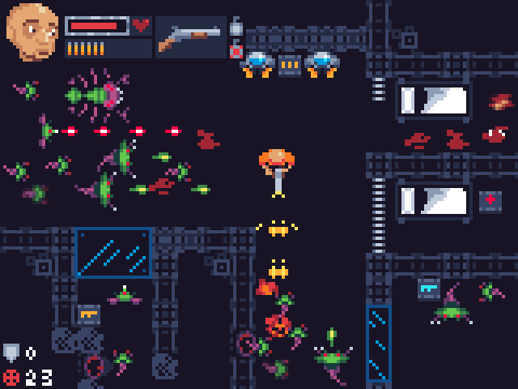
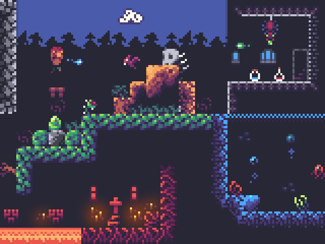
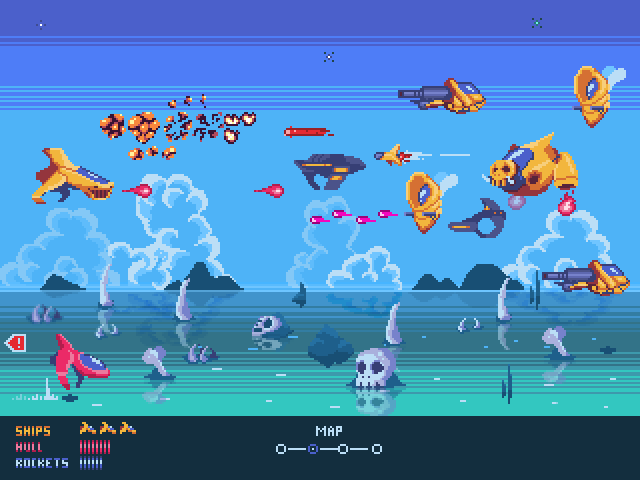
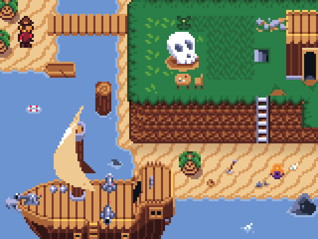

During the development of **32blit** we discovered a great pixel artist called Sam. His artwork is a perfect blend of retro, chunky-pixels, and limited colour palette -- with a modern flair.

> You can find more of Sam's work on [Itch.io](https://s4m-ur4i.itch.io/) -- check it out!

Initially we commissioned a fantasy tileset for our platformer game example and the results were so good that we kept throwing more ideas at him -- we have previews of them all further down this post so make sure you read to the end!

That inspired us to make our first stretch goal adding an extra *whopping* 1,024 sprites to your **32blit** asset pack. A week ago we polled our Kickstarter backers to suggest themes and then took the best ideas from y'all and got to work on them!

<iframe width="640" height="360" src="https://www.youtube.com/embed/ZR4yHidSHyk" frameborder="0" allow="accelerometer; autoplay; encrypted-media; gyroscope; picture-in-picture" allowfullscreen></iframe>
*A few words from Sam!*

## Stretch goal sprites

Sam had been working with us for three months at this point but we'd never met him since he's based in Germany. We though this was a great opportunity to fly him over to spend a couple of days with us!

Together we sifted through your comments and after combining similar ideas we selected two to take further:

### #1. Sci-Fi Top-Down Shooter

> A key feature of good pixel art is a limited palette. Try to stick to no more than 32 colours.

The most common themes mentioned were space/sci-fi and dinosaurs. Unfortunately with 8 by 8 tiles it's hard to do dinosaurs justice and, well, we freakin' love space so that worked for us!

Since we already have platformer, shmup, raycaster, racer, and RPG games examples underway for **32blit** we thought a nice addition would be the classic top-down shooter (think Alien Breed, Chaos Engine, etc.). This genre of game combines chaotic action with tense exploration and makes a great addition to the **32blit** library.

**Sam says**: *Top-down reminds me of GTA2, one of the first games I ever played. Fitting this in 8x8 pixels was a huge challenge - it's hard to make the character relatable when his entire head is a 4x4 pixel biege blob. Then I remembered the thing with DOOM where you had a portrait in the middle of your UI. From that the whole concept started. The portrait connects you with the character as you play.*

While visiting us Sam started working up the concept -- here's an *early preview* of it...

*A work in progress -- we start with a concept and hone it over time.*

**Sam says**: *This set still needs some overhaul, but the basics are there and the style is a quite different from the other spritesheets.*

> It's a challenge to fit so much variety into a single spritesheet

It always takes a few iterations to nail down the aesthetic and flesh out the details but it's starting to look great already, we'll share the final version of it with you when it's ready!

The spritesheet contains a main character with 8-directions of animation, a selection of weapons and power-ups, enemies, spaceship scenery, and some user interface elements to bring it all together.

### #2. Sprite smorgasbord

As well as general themes many of you asked for specific things like dice, fruit, playing cards, and inventory items. It's a great idea so we've decided to also put together a full spritesheet of things like this which you can use in your projects.

Sam will be moving onto this once the Sci-Fi spritesheet is completed!

## Platformer

Our first game demo is the platformer we show in the Kickstarter video. It looks great just with the sprites Sam has put together but the power of **32blit** lets us go way further with particle effects, lighting, and realtime soft shadows.

*Go carefully into those caves -- you never know what might be inside!*

**Sam says**: *I love side scrolling platforms and Metroidvanias. It’s what I remember from my childhood! It’s as much the cover and booklet art as the video games themselves -- dark backgrounds and colors that pop - I wanted to recreate that style here.*

The platformer spritesheet includes:

- Full character animations (walk, jump, idle, attack, fall, climb, swim)
- Six biomes; forest, rock, desert, castle, underwater, and underworld
- Bats, slime, naga, carnivorous plant, spiders, jellyfish, boss
- Skulls, ladders, trees, windows, altars, candles, spikes, and doors
- Potions, chests, torches, and coins

## Shmup

A classic fast-paced side-scrolling shoot 'em up with a post-apocalyptic theme. Take on waves of enemies including the mighty "Hog" while enjoying layer upon layer of parallax scrolling backgrounds.

This demo runs in the "hires" mode of **32blit** which means we can cram in more detail to the artwork.

*Pew pew! Lasers!*

**Sam says**: *The space shooter was a tough one for me. To be honest, the first iteration was *&$! and I had a hard time managing the visuals with so much going on at once - it’s all about managing the contrast. I scrapped it and just started drawing freehand with a pen - this worked so much better. Glad it turned out that way and I could learn!*

> We use a toned down palette for the background to ensure it isn't competing for visual attention with where the action is happening.

The "shmup" spritesheet includes:

- Eight different spaceships (including the glorious "Hog")
- Lasers, bullets, and fireballs with explosion animations
- Mountains, skulls and bones scenery elements
- Clouds, lots of clouds (I'm not kidding, Sam *really likes* clouds!)
- Environmental particles
- User interface elements

## RPG

Everybody loves a good RPG and everybody loves pirates, right? Well, you're going to love this pirate-themed RPG spritesheet! Spanning two full spritesheets we've covered buildings, boats, creatures, objects, environment, characters, dungeons, and more.

*Yarr me hearties -- where be the grog?*

**Sam says**: *Even though this set spans two full spritesheets to get everything down I needed to get a bit creative. For example sharing house and interior tiles with the pirate ship. It was about reusable sprites. It needed some care and time, drawing everything I wanted first, then having a look what could be replaced or combined. It felt like a LEGO puzzle. (I love LEGO)*

> Here the buildings use the same sprites as the boats. That lets us cram move variety into the spritesheet!

The pirate RPG spritesheet contains:

- Player character with animations (walk, push, pick up, sit, attack)
- Fourteen NPC characters with swappable bodies/heads
- Pirate boats, cannons, skull and crossbones!
- Creatures including monkey, turtle, parrot, shark
- Enemies including tentacle, skeleton bird, slime, bat, creepy hand, mimic, squid, skull, boss
- Pirate/carribean scenery with coastline, cliffs, signs, buildings, grassland, bridges, and ocean
- Indoor scenery including tables, chairs, shelving, grog, and more!

## License

We will be releasing all of the sprite assets under the [CC BY 4.0](https://creativecommons.org/licenses/by/4.0/) license. This means that you can use them for any purpose (including commercial) but you gotta include a credit back to the project in plain view.