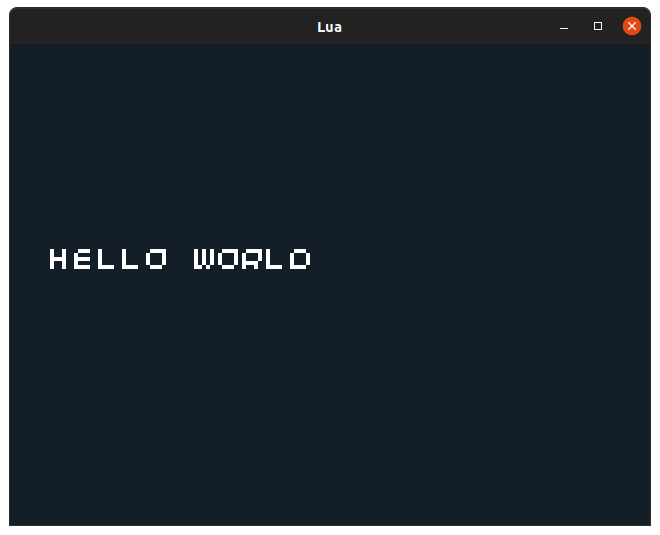
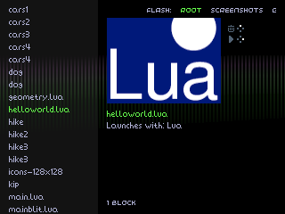

Title: Lua 0. Getting Started
Date: 2021-07-02 14:00
Modified: 2021-07-02 14:00
Category: Lua
Tags: lua
Slug: lua-00-getting-started
Authors: Philip Howard
Summary: Getting started with Lua on the 32Blit

- [Introduction](#introduction)
- [Debugging Locally](#debugging-locally)
- [Running On 32Blit](#running-on-32blit)
- [Basics Of A 32Blit Lua Script](#basics-of-a-32blit-lua-script)

## Introduction

Lua on the 32Blit is an application, like any other, with two key differences:

1. Instead of being a game in its own right, it understands and runs `.lua` scripts
2. It registers a file association with the 32Blit launcher so you can browse run `.lua` scripts right from the main menu

This introduction will teach you how to run 32Blit Lua files on your computer and on the 32Blit:

## Debugging Locally

You don't strictly *need* a 32Blit for testing out your `.lua` scripts. You can [build the Lua engine from source](https://github.com/32blit/32blit-lua/tree/main) and run it right on your computer or [grab the latest release for your platform](https://github.com/32blit/32blit-lua/releases/latest) and run a `.lua` file with the `--launch_path` argument like so:

```bash
./32blit_lua --launch_path script.lua
```

## Running On 32Blit

You will need an SD card inserted in your 32Blit to save `.lua` files or resources.

For copying games over to your 32Blit you'll need the 32blit tools. These require Python 3 and you can install them with:

```bash
python3 -m pip install 32blit --user
```

You must also install `32blit_lua.blit` onto your device so it can recognise and run Lua. [Grab the latest release for the 32Blit (STM32)](https://github.com/32blit/32blit-lua/releases/latest), eg: `32blit-lua-v0.0.2-STM32.zip`. Extract the file and use the 32Blit tool to install it:

```bash
32blit install 32blit_lua.blit
```

You should now be able to use the 32Blit tools to save Lua scripts, images and more to your device:

```bash
32blit install my_script.lua
```

This will save `my_script.lua` to the root of your SD card, in the main menu this is called "ROOT" in the list at the top, and you can navigate between "FLASH:" and "ROOT" with the left/right buttons on your 32Blit.

Navigate to your script and launch it with the right (pink) face button.

## Basics Of A 32Blit Lua Script

Every Lua script on the 32Blit has some basic requirements and must define the following functions:

1. `init` - for setting things up when your game first launches
2. `update` - for updating the state of your game, world or physics
3. `render` - called at 50FPS, for drawing your game world to the screen

A basic Lua script might look something like this:

```lua
function init()
end

function render(time)
    screen.pen = Pen(20, 30, 40)
    screen.clear()

    screen.pen = Pen(255, 255, 255)
    screen.text("Hello World", minimal_font, Point(10, 50))
end

function update(time)
end
```

This code will display the text "Hello World". You can save it as `helloworld.lua` and run it on your computer with:

```bash
./32blit_lua --launch_path helloworld.lua
```

You should see something like this:



Or you can save it to your 32blit with:

```bash
32blit install helloworld.lua
```

And it will show up in the launcher like this:

