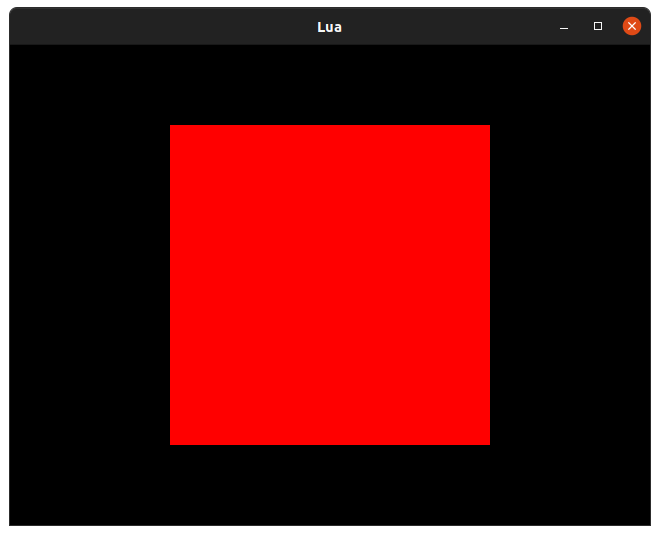
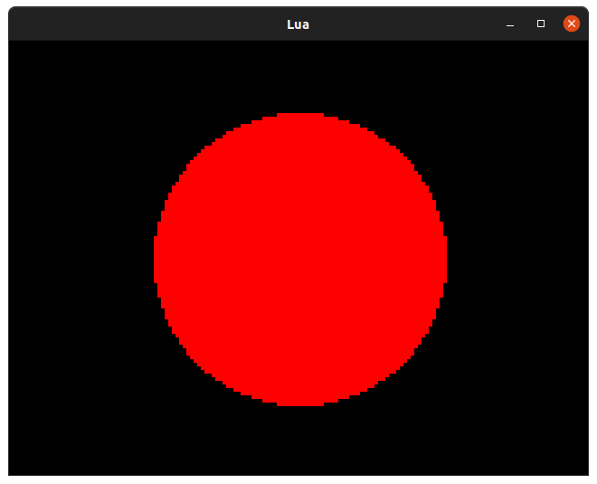
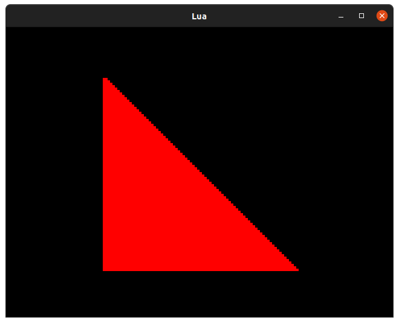
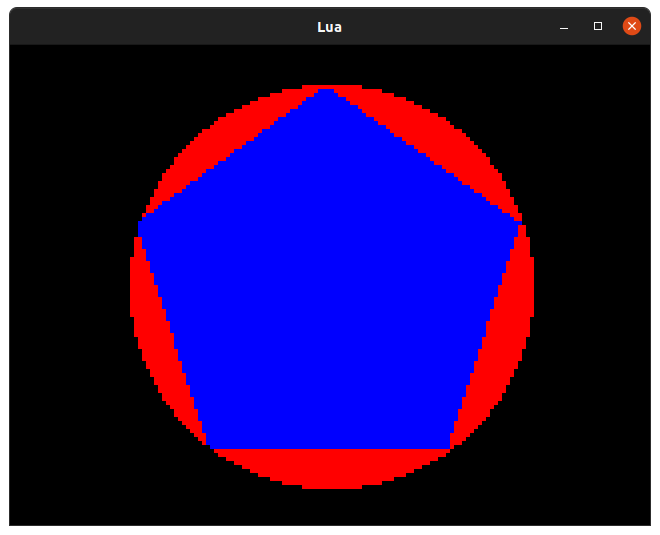

# 1. Lua: Drawing Shapes <!-- omit in toc -->

While you might not find primitive shapes useful in the graphical splendour of your finished games, you may find they are convenient for roughing out UI concepts, testing asumptions or perhaps even building something a little abstract.

The Lua API supports three kinds of shape:

1. Rectangle (and, by extension, square)
2. Circle
3. Polygon

We'll go over how you express these shapes in code, how to draw them and where you might find them useful.

### Drawing Rectangles

Rectangles are special and get their very own type: `Rect`.

```lua
tiny_square = Rect(0, 0, 10, 10)
```

A `Rect` describes a rectangle in terms of its position (`x`, `y`) and size (`w`, `h`) and can be used not only for drawing rectangles but for masking areas of the screen, specifying the bounds of a text area, determining regions to blit from/to and more besides. Understanding when and how to use `Rect` is vital, indeed you'll be using it in the next tutorial.

Rectangles are *drawn* with the `rectangle` function. Normally you'll do something like this:

```lua
screen.rectangle(Rect(0, 0, 10, 10))
```

The colour of your rectangle is determined by the current `pen`. `pen` is a property set on your `screen` or `Surface` and you can change it on a whim like so:

```lua
screen.pen = Pen(255, 0, 0) -- Really red Pen
```

Let's combine these commands together into something that draws a rectangle to the screen:

```lua
function init()
end

function update(time)
end

function render(time)
    screen.pen = Pen(255, 0, 0)
    screen.rectangle(Rect(40, 20, 80, 80))
end
```

Since our screen is 160x120 pixels in `Lores` mode we need to draw a 80x80 pixel rectangle at 40x20 for it to appear centered. Rectangles are orientated from their top-left corner.



### Drawing Circles

Unlike rectangles, circles don't have an equivilent to `Rect()` and are expressed instead in terms of their center - a `Point()` - and their raduis.

Let's draw a circle the same size as our square in the same location:

```lua
function init()
end

function update(time)
end

function render(time)
    screen.pen = Pen(255, 0, 0)
    screen.circle(Point(80, 60), 40)
end
```

Since the circle is orientated around its center, our `Point` should "point" at the center of the screen which is `160 / 2` by `120 / 2` or `Point(80, 60)`.




### Drawing Polygons

Polygons are slightly more complicated than rectangles and cirlces. While a rectangle *is* a polygon in theory we have a separate `rectangle` function because it's much faster to draw a rectangle if we can make assumptions about its shape.

#### Triangles

In Lua you can draw a polygon by supplying three or more `Point` arguments, or a table of `Point`s. Let's try the first and draw a triangle using the top left, bottom left, and bottom right corners of our square as the points:

```lua
function init()
end

function update(time)
end

function render(time)
    square = Rect(40, 20, 80, 80)
    screen.pen = Pen(255, 0, 0)
    screen.polygon(square.tl, square.bl, square.br)
end
```



#### Regular Sided Polygons

The best polygons start with 5 points and include the venerable Pentagon, Hexagon, Septagon and Octagon. Since we don't want to figure out what the points that make these up should be, we'll use a handy function instead:

```lua
function regular_polygon(polygon_center, polygon_sides, polygon_radius, polygon_rotation)
    local regular_polygon = {}
    polygon_rotation = polygon_rotation or 0
    polygon_rotation = math.rad(-(polygon_rotation % 360))

    -- The angle between each side
    polygon_angle = (math.pi * 2) / polygon_sides

    -- Orient the flat side down by default
    -- by rotating the shape half the angle between sides
    polygon_rotation = polygon_rotation + (polygon_angle / 2)

    for i = 0, polygon_sides, 1 do
        angle = polygon_angle * i
        angle = angle + polygon_rotation

        x = math.sin(angle) * polygon_radius
        y = math.cos(angle) * polygon_radius

        -- Translate the polygon to the desired origin
        -- Since sin/cos produce values from -1 to +1 its origin is 0, 0
        x = x + polygon_center.x
        y = y + polygon_center.y
        regular_polygon[#regular_polygon + 1] = Point(x, y)
    end

    return regular_polygon
end
```

Whoa whoa, that's a lot of code. You don't really need to understand it, but it's not quite so complicated as it first appears. The gist is that all the points of all regular sided polygons can be found around the permiter of a circle of the same size. The handy functions `sin` and `cos` take an angle and turn it into a value we can multiply by our polygon "radius" to get a point around that circle. We can get the angle to each point around the polygon from its center by dividing 360 by the number of sides and multiplying it back up again for each point.

Let's overlay a polygon over a circle to prove this:

```lua
function init()
end

function update(time)
end

function regular_polygon(polygon_center, polygon_sides, polygon_radius, polygon_rotation)
    local regular_polygon = {}
    polygon_rotation = polygon_rotation or 0
    polygon_rotation = math.rad(polygon_rotation % 360)

    -- The angle between each side
    polygon_angle = (math.pi * 2) / polygon_sides

    -- Orient the flat side down by default
    -- by rotating the shape half the angle between sides
    polygon_rotation = polygon_rotation + (polygon_angle / 2)

    for i = 0, polygon_sides, 1 do
        angle = polygon_angle * i
        angle = angle + polygon_rotation

        x = math.sin(angle) * polygon_radius
        y = -math.cos(angle) * polygon_radius

        -- Translate the polygon to the desired origin
        -- Since sin/cos produce values from -1 to +1 its origin is 0, 0
        x = x + polygon_center.x
        y = y + polygon_center.y
        regular_polygon[#regular_polygon + 1] = Point(x, y)
    end

    return regular_polygon
end

function render(time)
    screen.pen = Pen(0, 0, 0)
    screen.clear()

    -- Create a point in the middle of the screen
    center = Point(screen.bounds.w / 2, screen.bounds.h / 2)

    -- Draw a red circle
    screen.pen = Pen(255, 0, 0)
    screen.circle(center, 50)

    -- Draw a blue regular pentagon
    screen.pen = Pen(0, 0, 255)
    screen.polygon(regular_polygon(center, 5, 50))
end
```



Well, look at that! The five points of our pentagon all touch the edge of the circle... well, more or less, since the drawing function is a little imprecise and we don't have lots of pixels to work with. You can use the `regular_polygon` function in your code if you need to draw a regular polygon without all the pesky working out.

> Note: we negate the `y` axis when drawing our shape because our coordinate system goes from `0,0` in the top-left corner of the screen to `159,119` in the bottom right and is flipped vertically in relation to the Cartesian coordinates you might encounter in geometry. Indeed if we take the angle `0` as indicating the top of our circle and note that along the x-axis `sin(0) == 0` and along the y-axis `cos(0) == 1` it's clear that our shapes will be mirrored vertically without this flip.

### Challenges

1. Can you draw a concave polygon?
2. Can you draw an interesting scene with primitive shapes?
3. Can you build a game based entirely on shapes?
4. Can you create a spinning 3D cube out of polygons?