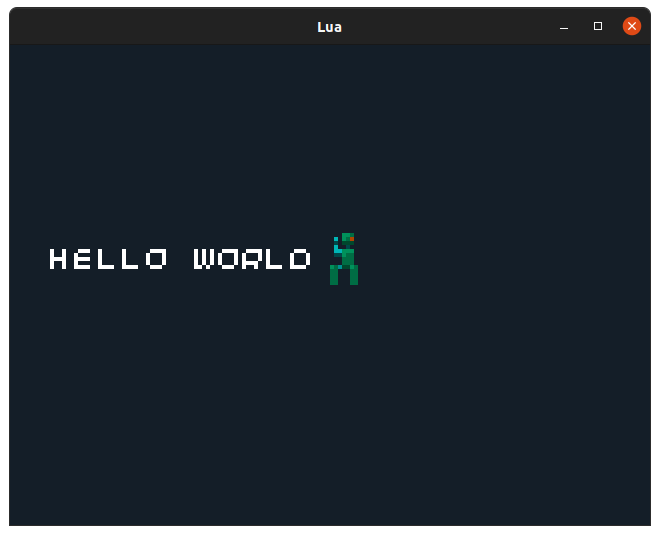
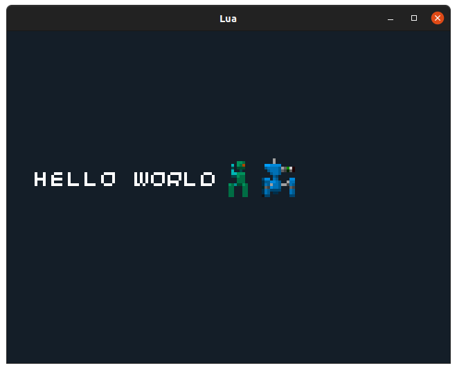
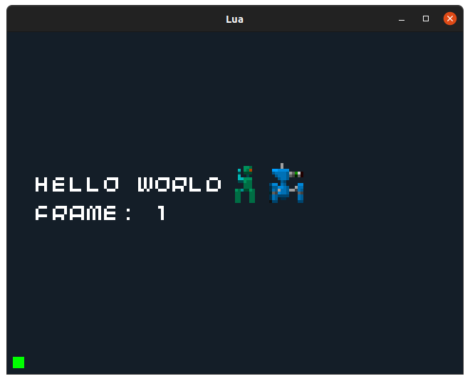
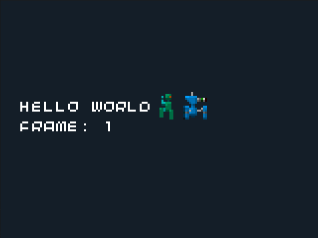

Title: Lua 2. Working With Sprites
Date: 2021-07-02 14:00
Modified: 2021-07-02 14:00
Category: Lua
Tags: lua, tutorial
Slug: lua-02-working-with-sprites
Authors: Philip Howard
Summary: Working with sprites on the 32Blit

- [Introduction](#introduction)
- [Finding/Creating Sprites](#findingcreating-sprites)
- [Preparing Sprites For 32Blit Lua](#preparing-sprites-for-32blit-lua)
- [Loading Sprites](#loading-sprites)
- [Drawing Sprites](#drawing-sprites)
- [Building Bigger Characters](#building-bigger-characters)
- [Animating Sprites](#animating-sprites)
- [Challenges](#challenges)

## Introduction

Sprites are an essential graphical building block for building great-looking 2D games. In the world of 32Blit a "sprite" is considered an 8x8 pixel image. It might comprise a whole tiny character, fruit or icon or it may be part of a larger object made up of many sprites. Sprites can also represent single animation frames, and the full walk cycle of a character - for instance - might use a dozen sprites.

## Finding/Creating Sprites

## Preparing Sprites For 32Blit Lua

Once you have your 128x128 pixel spritesheet, you must prepare it for loading on 32Blit. If you used the 32Blit Sprite Editor then - good news - the `.bmp` output file is compatible with 32Blit Lua and you can just load it right up without any preparation, skip to the next step!

If you created your spritesheet using another application, found one online or are using one of the 32Blit SDK spritesheets you'll need to convert it using the 32Blit tools:

```
32blit image --input_type image --input_file spritesheet.bmp --output_file spritesheet.bin
```

This tells the tools to pack an image - `spritesheet.bmp` - into a packed, 32Blit spritesheet file - `spritesheet.bin`.

## Loading Sprites

Now you have either a `.bmp` file or a `.bin` file ready to load into your Lua script. Fortunately you just need one line in your `init` function:

```lua
function init()
    screen.load_sprites("spritesheet.bmp")
end

function render(time)
end

function update(time)
end
```

## Drawing Sprites

So we're on the same page, I'm going to use the `tankbot.bmp` supplied with this tutorial. This sheet contains some animated robots I whipped up in Sprite Editor.

The very top row of sprites is a simple little walking robot consisting of two sprites. Let's draw the whole robot:

```lua
function init()
    screen.load_sprites("tankbot.bmp")
end

function render(time)
    screen.pen = Pen(20, 30, 40)
    screen.clear()

    screen.pen = Pen(255, 255, 255)
    screen.text("Hello World", minimal_font, Point(10, 50))

    screen.sprite(Point(0, 0), Point(80, 44))
    screen.sprite(Point(0, 1), Point(80, 52))
end

function update(time)
end
```

If we run this code, we should see:



The important lines here are:

```lua
    screen.sprite(Point(0, 0), Point(80, 44))
    screen.sprite(Point(0, 1), Point(80, 52))
```

A sprite can be referred to by its index in the spritesheet - from 0 to 255 - or, more easily, by its X and Y coordinates using a `Point`. In this case the points `Point(0, 0)` and `Point(0, 1)` describe the very top left sprite in the sheet, and the one immediately beneath it.

The second `Point` supplied to the `sprite` function is the location at which it should be drawn on the screen. By varying which sprite is drawn, and where it's drawn, you can animate a character walking across the screen.

## Building Bigger Characters

Two sprites make for a fairly tiny character, but what about the larger walking tank in `tankbot.bmp`. It consists of *four* sprites starting at `Point(0, 5)`. Let's draw it:

```lua
function init()
    screen.load_sprites("tankbot.bmp")
end

function render(time)
    screen.pen = Pen(20, 30, 40)
    screen.clear()

    screen.pen = Pen(255, 255, 255)
    screen.text("Hello World", minimal_font, Point(10, 50))

    -- Small robot
    screen.sprite(Point(0, 0), Point(80, 44))
    screen.sprite(Point(0, 1), Point(80, 52))

    -- Big tank
    screen.sprite(Point(0, 5), Point(90, 44))
    screen.sprite(Point(0, 6), Point(90, 52))
    screen.sprite(Point(1, 5), Point(98, 44))
    screen.sprite(Point(1, 6), Point(98, 52))
end

function update(time)
end
```

If we run this code, we should see:



That's an awful lot of lines to draw one character, though, what if we could combine those from:

```lua
    -- Big tank
    screen.sprite(Point(0, 5), Point(90, 44))
    screen.sprite(Point(0, 6), Point(90, 52))
    screen.sprite(Point(1, 5), Point(98, 44))
    screen.sprite(Point(1, 6), Point(98, 52))
```

Into:

```lua
    -- Big tank
    screen.sprite(Rect(0, 5, 2, 2), Point(90, 44))
```

Well. It turns out we can. The `sprite` function will accept a `Rect` pointing to the sprite at the top left corner of our character, and giving the width/height of the character in sprites. Handy!

Let's use `Rect` for our smaller sprite too:

```lua
function init()
    screen.load_sprites("tankbot.bmp")
end

function render(time)
    screen.pen = Pen(20, 30, 40)
    screen.clear()

    screen.pen = Pen(255, 255, 255)
    screen.text("Hello World", minimal_font, Point(10, 50))

    -- Small robot
    screen.sprite(Rect(0, 0, 1, 2), Point(80, 44))

    -- Big tank
    screen.sprite(Rect(0, 5, 2, 2), Point(90, 44))
end

function update(time)
end
end
```

This is great because we only need to update *one* thing to animate our characters. The "X" position of each `Rect`.

## Animating Sprites

Animating sprites is simple- you just show the individual sprite frames in sequence. But how do we do that?

Normally when we're animating a character we want the procession of frames to be slow. Much slower than our actual framerate. Our walk cycle and big tank action cycle, in this case, have eight frames each.

At 50 FPS an eight frame animation would take all of 160 milliseconds to complete... that's just under two tenths of a second. Yikes!

We want to slow this right down to *one* frame every tenth of a second (100 milliseconds) and we'll use a `Timer` to do this:

```lua
timer = Timer()
frame = 0

-- Store our small/big robot locations somewhere tidy
small_robot = Rect(0, 0, 1, 2)
big_robot = Rect(0, 5, 2, 2)

-- Function that the timer calls every 100ms
function animate(timer)
    frame = frame + 1
    if frame > 7 then
        frame = 0
    end
end

function init()
    screen.load_sprites("tankbot.bmp")
    timer:init(animate, 100) -- new 100ms timer
    timer:start() -- start the timer!
end

function render(time)
    screen.pen = Pen(20, 30, 40)
    screen.clear()

    screen.pen = Pen(255, 255, 255)
    screen.text("Hello World", minimal_font, Point(10, 50))

    -- Show the current frame
    screen.text("Frame: " .. frame, minimal_font, Point(10, 60))

    -- Small robot
    screen.sprite(small_robot, Point(80, 44))

    -- Big tank
    screen.sprite(big_robot, Point(90, 44))
end

function update(time)
end

```

Run this code and you'll see the frame count from 0 to 7 and back to 0.



The `Timer()` is given two arguments, the function to call and the interval it should call it. In this case we pass it the `animate` functon and tell it to call `animate` every 100ms. Animate just adds 1 to the frame counter every interval and resets the frame counter to 0 if it exceeds 7... 0 to 7 is eight frames:

```lua
function animate(timer)
    frame = frame + 1
    if frame > 7 then
        frame = 0
    end
end
```

This is great. We have a frame number and we can control how fast it changes and what range it spans.

"How do we translate that into animation?" you ask.

With a couple of additional lines in our `animate` function:


```lua
-- Function that the timer calls every 100ms
function animate(timer)
    frame = frame + 1
    if frame > 7 then
        frame = 0
    end
    -- Update the sprites we're pointing at based on the current frame
    small_robot.x = frame * small_robot.w
    big_robot.x = frame * big_robot.w
end
```

These lines update the "X" position of our sprite using the current frame. By multiplying the current frame by the sprite width we can step over multiple, multi-sprite characters:

```lua
    small_robot.x = frame * small_robot.w
    big_robot.x = frame * big_robot.w
```

And the final result is beautiful animation:



## Challenges

A complete example - `sprites.lua` - is saved alongside this guide for you to play with!

1. Can you move a character as it animates? Tip: the second `Point` given to `sprite` is the location where it's drawn.
2. Can you animate the walk cycle of the big tank?
3. Can you figure out a way to switch between walk/shoot animations?
4. Can you create and animate your own character?