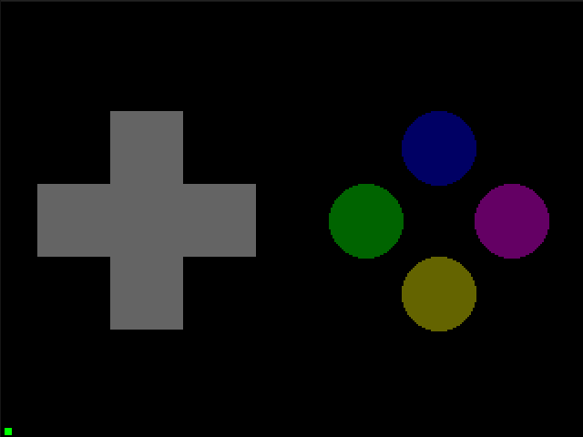
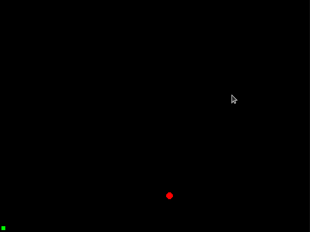

# 3. Lua: Processing Input <!-- omit in toc -->

Input is crucial to making a playable game. 32blit includes a d-pad, analog stick, face buttons and tilt sensor.

This tutorial covers the benefits of the different input methods, where you might use them and how to implement them in your game.

- [D-Pad And Face Buttons](#d-pad-and-face-buttons)
- [Analog Joystick](#analog-joystick)
- [Tilt](#tilt)

### D-Pad And Face Buttons

The D-Pad and Face Buttons are collected together into "buttons".

32Blit makes handling distinct button events a little easier by separating out input into "just pressed", "just released" and "current state". You can access these in Lua as:

1. `buttons.pressed` - buttons that were pressed since last update
2. `buttons.released` - buttons that were released since last update
3. `buttons.state` - the current state of all buttons (whether they are presently pressed or released)

Since we know how to draw shapes, let's use them to indicate whether a particular button has been pressed:

```lua
function init()
    set_screen_mode(ScreenMode.hires)
end

function update(time)
    button_a_colour = Pen(100, 0, 100)
    button_b_colour = Pen(100, 100, 0)
    button_x_colour = Pen(0, 0, 100)
    button_y_colour = Pen(0, 100, 0)
    if buttons.state & Button.A ~= 0 then
        button_a_colour = Pen(255, 0, 255)
    end
    if buttons.state & Button.B ~= 0 then
        button_b_colour = Pen(255, 255, 0)
    end
    if buttons.state & Button.X ~= 0 then
        button_x_colour = Pen(0, 0, 255)
    end
    if buttons.state & Button.Y ~= 0 then
        button_y_colour = Pen(0, 255, 0)
    end
end

function render(time)
    screen.pen = Pen(0, 0, 0)
    screen.clear()

    buttons_center = Point((screen.bounds.w / 4) * 3, screen.bounds.h / 2)

    -- Draw the 4 face buttons
    button_distance = 40 -- Distance each button circle should be from the middle
    button_size = 20 -- Radius of the button circles
    
    screen.pen = button_y_colour
    screen.circle(buttons_center + Point(-button_distance, 0), button_size)

    screen.pen = button_a_colour
    screen.circle(buttons_center + Point(button_distance, 0), button_size)

    screen.pen = button_x_colour
    screen.circle(buttons_center + Point(0, -button_distance), button_size)

    screen.pen = button_b_colour
    screen.circle(buttons_center + Point(0, button_distance), button_size)
end
```

There's quite a lot going on here, so let's unpack it piece by piece. First you should understand that - by default - all Lua's variables are placed in the `global` scope. That means a `button_a_colour` assigned in our `update` function will be available in `render` and everywhere else. To override this behaviour in Lua and make a variable `local` you must explicitly prefix a variable when declaring it, ie: `local button_a_colour = Pen(100, 0, 100)`.

First we'll bump the screen into `hires` mode:

```
function init()
    set_screen_mode(ScreenMode.hires)
end
```

We're doing a lot of circle drawing here, and we want them to look at least somewhat smooth.

Next, the actual button reading code goes into `update`. This is because things like `buttons.pressed` are updated on each `update` and, more importantly, because for good practise you should be keeping your *state* changes in `update` and your *drawing* in `render`.

```lua
function update(time)
    button_a_colour = Pen(100, 0, 100)
    button_b_colour = Pen(100, 100, 0)
    button_x_colour = Pen(0, 0, 100)
    button_y_colour = Pen(0, 100, 0)
    if buttons.state & Button.A ~= 0 then
        button_a_colour = Pen(255, 0, 255)
    end
    if buttons.state & Button.B ~= 0 then
        button_b_colour = Pen(255, 255, 0)
    end
    if buttons.state & Button.X ~= 0 then
        button_x_colour = Pen(0, 0, 255)
    end
    if buttons.state & Button.Y ~= 0 then
        button_y_colour = Pen(0, 255, 0)
    end
end
```

Each button is assigned a dark version of its colour (approximately, anyway) by default. These are the colours that each button circle will appear as when they are *not* pressed:

```lua
button_a_colour = Pen(100, 0, 100)
button_b_colour = Pen(100, 100, 0)
button_x_colour = Pen(0, 0, 100)
button_y_colour = Pen(0, 100, 0)
```

Next, for each button the `state` is checked. The `state` of a button tells us if it's currently held down or not. Checking `buttons.state` is something you might do for the accelerator of a car, or the pressure of a brush stroke. Conversely `pressed` and `released` tell you if a button was pressed or released since the last update, holding down or releasing a button will trigger this once.

To check the state of a single button we *bitwise AND* its mask with `buttons.state` and check if the resultnig value is not zero:

```lua
if buttons.state & Button.Y ~= 0 then
    button_y_colour = Pen(0, 255, 0)
end
```

Breaking this down, imagine we had eight buttons and button `X` was pressed. Our `buttons.state` might be the number 4, which - represented in binary - is `00000100`. If we create a mask for button `X` that also equals `00000100` and *AND* the two together then the result will be a new binary number with whaever bits are set in both the button state and mask:

```bash
00000100 AND 00000100 = 00000100
```

Now let's say button `Y` is also pressed, our  `buttons.state` now equals 20 which is `00001100` in binary. If we mask just the `X` button (remember it's `00000100`) with our new state, we'll get the same output value:

```bash
00001100 AND 00000100 = 00000100
```

Effectively this is a way of asking "is this bit set in our button state" and since buttons only have two states then binary bits are a great way to represent them.

This method feels a little clunky in Lua, but closely resembles how you accomplish the same task in C++ so it's a good stepping stone.

Finally once the button state has been checked and the colour either set, or left at its default value, in the `render()` function.

Since we're always drawing the button circle, the colour can be set and the circle drawn and whether it shows in the pressed/released colour depends entirely on the `update()` function:

```lua
screen.pen = button_y_colour
screen.circle(buttons_center + Point(-button_distance, 0), button_size)
```



### Analog Joystick

Analog is easier than it sounds. The joystick can be moved in two directions Left/Right corresponding to its `x` axis and Up/Down corresponding to its `y` axis. Fully left gives an `x` value of `-1` and fully right an `x` value of `1`. If you wish to move something around on screen you can just add the joystick vector to its position:

```lua
function init()
    set_screen_mode(ScreenMode.hires)
    cursor = Vec2(screen.bounds.w / 2, screen.bounds.h / 2)
end

function update(time)
    cursor = cursor + (joystick * 2.0)

    cursor.x = math.max(0, math.min(screen.bounds.w, cursor.x))
    cursor.y = math.max(0, math.min(screen.bounds.h, cursor.y))
end

function render(time)
    screen.pen = Pen(0, 0, 0)
    screen.clear()

    screen.pen = Pen(255, 0, 0)
    screen.circle(Point(cursor.x, cursor.y), 3)
end
```

Okay, that's a bit more than just updating a position. Let's break it down.

First we're creating a new global `cursor` variable. We want it to be a `Vec2` since joystick is also a `Vec2`, and we want it to start in the middle of the screen:

```lua
function init()
    set_screen_mode(ScreenMode.hires)
    cursor = Vec2(screen.bounds.w / 2, screen.bounds.h / 2)
end
```

Now in the `update` function we add `joystick` to the `cursor`. In this instance we're also multiplying it by 2.0, effectvely scaling the joystick's range from `+-1.0` to `+-2.0` and making our cursor move a bit faster:


```lua
function update(time)
    cursor = cursor + (joystick * 2.0)

    cursor.x = math.max(0, math.min(screen.bounds.w, cursor.x))
    cursor.y = math.max(0, math.min(screen.bounds.h, cursor.y))
end
```

The lines below with `min` and `max` are bounds clamping. These ensure that our cursor's `x` and `y` positions never go below 0 or above the screen width/height. The cursor would disappear off the screen if this happened!

Finally we draw the cursor to the screen by clearing the screen to black and drawing a small circle:

```lua
function render(time)
    screen.pen = Pen(0, 0, 0)
    screen.clear()

    screen.pen = Pen(255, 0, 0)
    screen.circle(Point(cursor), 3)
end
```

Since `screen.circle` requires a `Point` we must use `Point(cursor)` to convert the `Vec2`. `Point` handily accepts either x and y values, or a `Vec2` to be converted into a point.

Why? Well a `Vec2` doesn't represent any one point on screen since it details with floating point values and could be something like `Vec2(0.001, 5.987162)`. We can guess this might equal `Point(0, 6)` but it's easier for our screen drawing functions not to make these kinds of assumptions for us, and just take a nice, tidy pair of whole numbers in the form of a `Point`.

On the desktop 32Blit emulates the joystick using the mouse:



### Tilt
